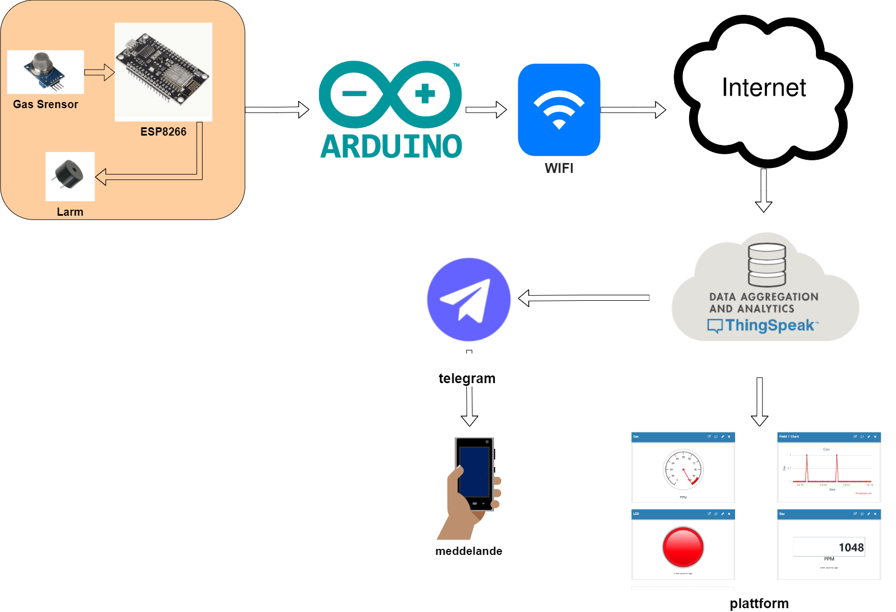
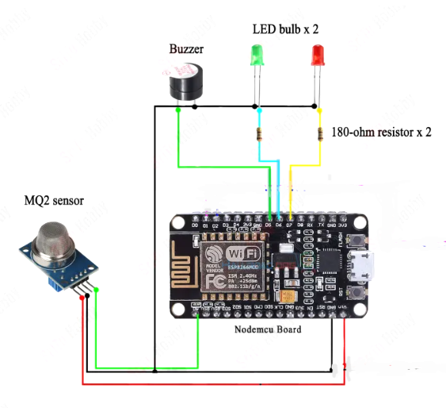
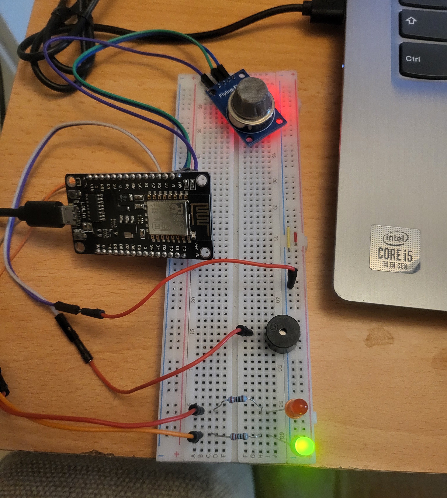
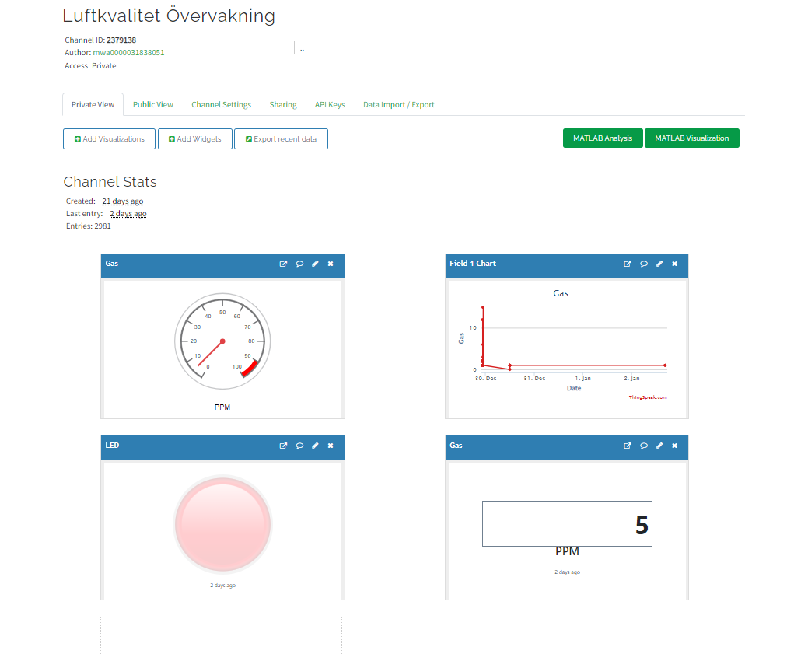
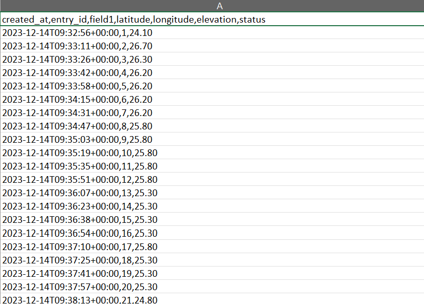
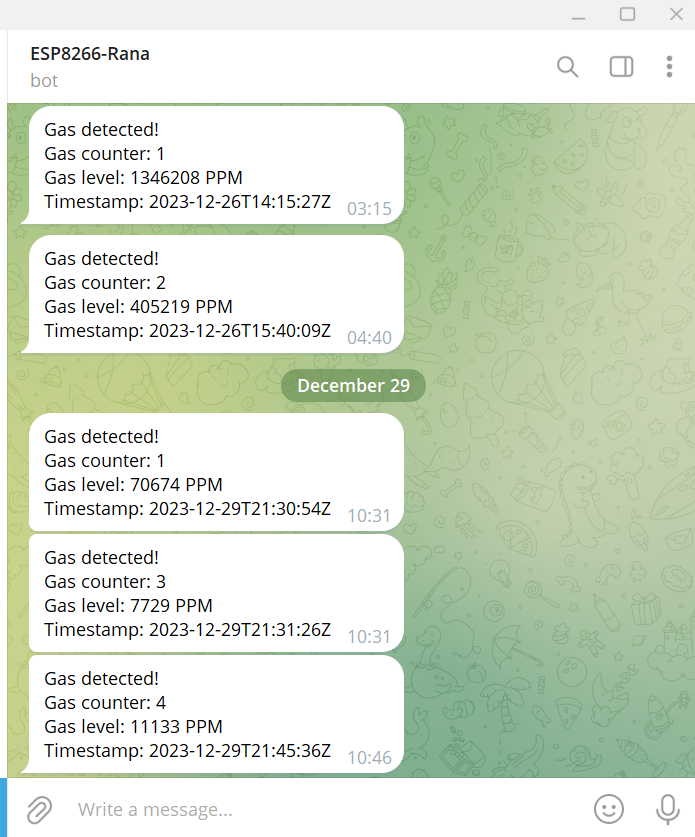
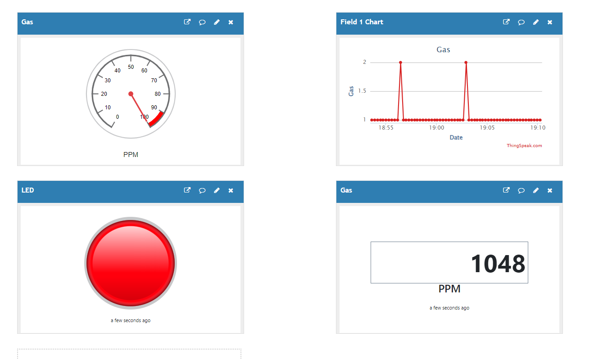

<h1 align="center" id="top">Examensarbete Luftkvalitet Övervakning IoT projekt med ESP8266</h1>

<h1 align="center" id="top"></h1>

## Innehållsförteckning.

- [Sammanfattning](#Sammanfattning)
- [Komponenter](#Komponenter)
- [Översikt](#översikt)
- [Målet ](#Målet )
- [Kopplingsschema](#kopplingsschema)
- [Metodik](#Metodik)
- [Analys och Diskussion](#Analys-och-Diskussion)
- [Slutsatser](#Slutsatser)


## Sammanfattning
Denna projektinriktning fokuserar på att utveckla och implementera en IoT-baserad lösning för övervakning av luftkvaliteten i inomhusmiljöer.
Genom att integrera en MQ2-gassensor med ESP8266 och dra nytta av Thingspeak-plattformen för datalagring strävar projektet efter att erbjuda en kostnadseffektiv och användarvänlig metod för att noggrant övervaka och rapportera luftkvalitetsparametrar.
Huvudmålet är att skapa ett pålitligt system som ger realtidsdata om luftkvaliteten och ger snabba varningar vid avvikande nivåer,
därigenom bidrar till att skapa en hälsosam inomhusmiljö. 

## Komponenter

- Sensor: MQ2 gassensor , Buzzer .
- IoT-enhet: ESP8266-mikrokontroller för datainsamling.
- ThingSpeak : molnbaserad kommunikation och lagring.
- Python-script : Behandlar data och skickar meddelanden till Telegram.
- Telegram: Meddelandeservice för att informera användare om händelser.


<p align="right">(<a href="#top">tillbaka till toppen</a>)</p>


## Översikt   




<p align="right">(<a href="#top">tillbaka till toppen</a>)</p>

## Målet 

Målen med detta projekt strävar efter att uppnå flera aspekter inom området luftkvalitetsövervakning och dess påverkan på människors hälsa och välbefinnande:
-Skapa medvetenhet: Genom att utveckla och implementera en IoT-lösning för luftkvalitetsövervakning syftar projektet till att öka medvetenheten om vikten av ren luft i inomhusmiljöer.
-Förbättra hälsa: Genom att erbjuda realtidsdata om luftkvaliteten och varningar vid potentiellt skadliga nivåer strävar projektet efter att direkt påverka hälsan hos de som vistas i övervakade områden.
-Forskningsbidrag: Genom att noggrant analysera och rapportera resultatet av luftkvalitetsövervakningen, avser projektet att bidra till forskningsområdet genom att tillhandahålla insikter och data som kan vara användbara för framtida studier.
-Teknisk utveckling: Projektet syftar också till att utforska och förbättra tekniska aspekter av IoT-lösningar och sensorintegration för att övervaka luftkvalitet på ett mer effektivt och kostnadseffektivt sätt.


## Kopplingsschema






<br>

<p align="right">(<a href="#top">tillbaka till toppen</a>)</p>

## Metodik

1. Val av Sensorer
Sensorvalet baseras på projektets behov och syfte.
Användning av MQ2-gassensorn för dess förmåga att detektera olika gaser.

2. Anslutning och Programmering med ESP8266
Anslutning av sensorn och ESP8266 (NodeMCU) med hårdvarupinnar.
Kod inkluderar Wi-Fi-konfiguration, sensorkonfiguration och dataöverföring till ThingSpeak.
Visuell och ljudvarning vid avvikande nivåer.

3. ThingSpeak Integration


-Kanaler: I ThingSpeak är data organiserad i kanaler. En kanal är som en behållare för din data. Varje kanal har en unik identifierare och du kan skapa flera kanaler för olika projekt eller uppsättningar data.

-Fält: Inom varje kanal finns det fält där du lagrar specifika typer av data.


-Skriv API-nyckel: För att skicka data till en ThingSpeak-kanal använder du en Write API Key. Den här nyckeln är som ett lösenord som gör att din enhet eller applikation kan skriva data till en specifik kanal.

```
String apiKey = " API_key"; // Enter your Write API key from ThingSpeak
const char *server = "api.thingspeak.com";
```

-Läs API-nyckel: För att hämta data från en ThingSpeak-kanal använder du en Read API Key. Denna nyckel låter din applikation läsa data från en specifik kanal.

```
// Replace 'YOUR_THINGSPEAK_API_KEY' with your ThingSpeak read API key 
thingspeak_api_key = 'CO4NCKIR4JRLUTCU'
thingspeak_channel_id = '2379138'
```





-Datalagring: ThingSpeak låter dig lagra och hämta tidsseriedata. Varje post i databasen innehåller en tidsstämpel, vilket är viktigt för att spåra data över tid.




4. Python-script (Telegram-integration)

-Ett Python-script används för att läsa data från ThingSpeak-plattformen.
-Om gasnivån överstiger en tröskel, skickas ett meddelande till en Telegram-bot med information om gasdetektionen.

```
async def get_thingspeak_data():
    url = f'https://api.thingspeak.com/channels/2379138/fields/1.json?api_key=CO4NCKIR4JRLUTCU&results=2'
    params = {'api_key': thingspeak_api_key, 'results': 2}
    response = await loop.run_in_executor(None, lambda: requests.get(url, params=params))
    data = response.json()
    return data['feeds'][0] if 'feeds' in data else None
```

5. Telegram meddelande:

-Skapa en Telegram-bot: Börja med att skapa en ny bot på Telegram med hjälp av "BotFather"-boten. Följ instruktionerna från BotFather för att få en unik API-token för din bot.

-Bot Token: API-token är avgörande för att autentisera och interagera med Telegram Bot API.Se till att hålla ditt bot-token säkert och undvik att dela det offentligt.

-Integration i din applikation: Integrera Telegram API i din applikationskod. Du kan använda ett programmeringsspråk som Python för detta ändamål. Använd metoden sendMessage i Telegram Bot API för att skicka meddelanden.

```
// Ersätt 'YOUR_BOT_TOKEN' och 'YOUR_CHAT_ID' med faktiska värden
bot_token = 'DITT_BOT_TOKEN'
chat_id = 'DITT_CHAT_ID'
```

-HTTP POST-begäran: Gör en HTTP POST-begäran till Telegram Bot API:s sendMessage-ändpunkt.  Inkludera bot-token, chat ID (där meddelandet ska skickas) och texten i meddelandet i din begäran.

```
//Gör API-begäran
url = f'https://api.telegram.org/bot{bot_token}/sendMessage'
params = {'chat_id': chat_id, 'text': meddelandetext}
svar = requests.post(url, json=params)
```





<p align="right">(<a href="#top">tillbaka till toppen</a>)</p>


## Analys och Diskussion

Analys och Diskussion
Resultatanalys: Luftkvalitetsdata som samlats in och analyserats visar på flera viktiga observationer och mönster:

1-Ökad Koldioxidnivå vid Gasdetektion:
-Vid gasdetektion, särskilt när gasnivån överskrider tröskelvärdet (1000 PPM), observeras en markant ökning av koldioxidnivåerna.
-Detta indikerar en stark korrelation mellan detekterade gasnivåer och koldioxidkoncentration.

2-Effektiv Varningssignal:
-Den visuella och ljudmässiga varningssignalen (rött ljus, buzzer) aktiveras på ett effektivt sätt vid upptäckt av signifikanta gasnivåer.
-Detta mönster bekräftar att systemet fungerar som avsett och ger omedelbar uppmärksamhet till användarna.

3-Konsekvent Dataöverföring till ThingSpeak:
-Luftkvalitetsdata överförs konsekvent till ThingSpeak-plattformen, vilket möjliggör en kontinuerlig övervakning över tiden.
-Detta möjliggör historisk analys och ger användbara insikter om luftkvalitetstrender.


<p align="right">(<a href="#top">tillbaka till toppen</a>)</p>


## Slutsatser 

Resultatanalysen stöder effektiviteten och användbarheten av den implementerade lösningen för luftkvalitetsövervakning. Gasdetektionssystemet verkar vara pålitligt och ger användare relevanta varningar vid behov. Dessutom möjliggör överföringen av data till ThingSpeak en omfattande övervakning av luftkvaliteten över tid.
Vidare forskning och analys kan fokusera på att korrelera de observerade gasnivåerna med specifika påverkande faktorer och överväga ytterligare parametrar för en mer omfattande bedömning av inomhusluftkvaliteten.

<p align="right">(<a href="#top">tillbaka till toppen</a>)</p>


<video width="640" height="360" controls src="gas_sensor.mp4" type="video/mp4">


///README har skapats av Rana Alwan///.


